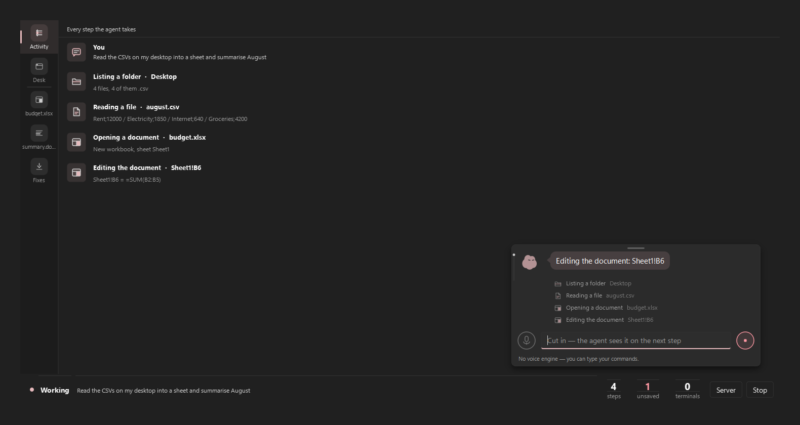
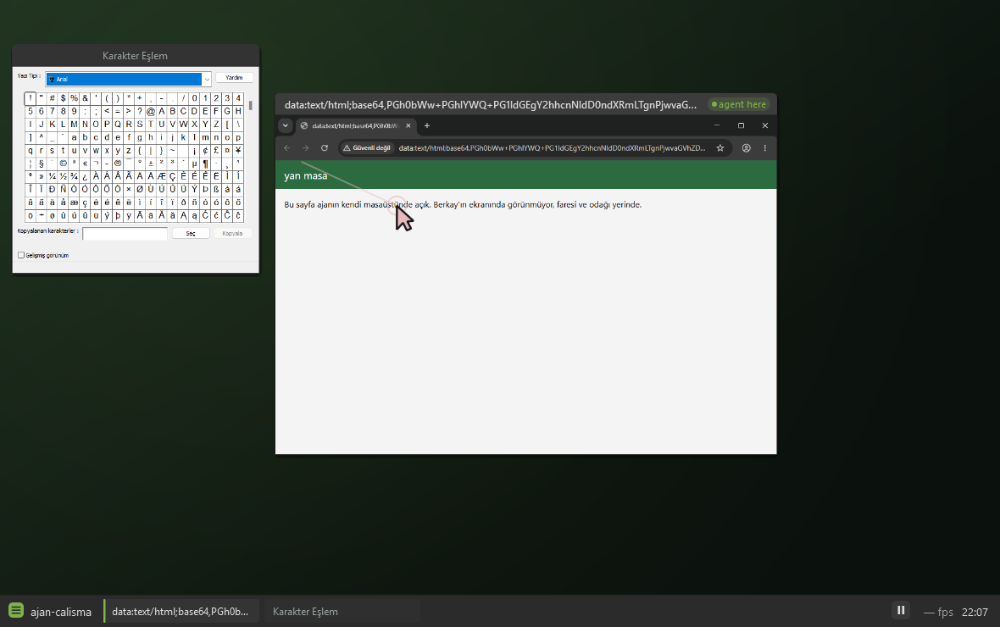

# Yan Masa

A Windows 11 computer-control agent that gets **its own desktop and its own
cursor**, so it can work while you keep using yours.

[](LICENSE)
[](https://www.python.org/)
[](#requirements)
[](https://doc.qt.io/qtforpython-6/)
[](https://docs.anthropic.com/)
[](tests/test_computer.py)



*Türkçe: [README.tr.md](README.tr.md) — the long-form document, with the
measurements behind every decision.*

---

## The problem this solves

Every computer-use demo takes your machine hostage. The agent moves *your*
mouse, steals *your* focus, types into whatever window happens to be in
front. You sit and watch, because touching anything breaks the run.

`side_*` in this project is the other way round. Windows lets you create a
second desktop object — its own window list, its own focus chain, its own
cursor position. The agent launches apps there and drives them with posted
messages instead of `SendInput`. Nothing in `backend/computer/mesaj.py`
can move the physical cursor, and a test proves it by reading the source.

Measured on both classic Win32 (`charmap.exe`) and Chromium (Chrome):

| what | how | verification |
|---|---|---|
| typing | `WM_CHAR` | `ağır işçi ÖĞÜŞ 42` read back verbatim |
| clicking | `WM_LBUTTON*` | dropdown 0→1; page red → green |
| capture | `PrintWindow` | 1100×760, real content |
| physical cursor | — | never called once during the run |

Three limits, and the agent is told about all three in the `side_launch`
description: Store apps open no window there (including Windows 11's
Notepad), modifier combinations like `Ctrl+S` do not work because the
modifier is not held down on that thread, and there is no drag-and-drop.

### The agent's desk

The side workspace was invisible: `side_capture` only produced a frame when
the agent acted, so between actions the screen was frozen and "what is
happening right now" had no answer.

`app/masa.py` is that answer — a window that captures every window on the
hidden desktop eight times a second and lays them out where they really
are, with the agent's cursor moving over them. Measured: a 1100x760 Chrome
window costs 54 ms per frame, so ~18 fps is the ceiling; eight is chosen
deliberately, because this loop runs on the same machine as the agent's own
work and the agent has priority. Capture runs on its own thread and stops
whenever the window is hidden.

**It looks like a Linux Mint desktop, and that is the point.** What you are
looking at is not your desktop. If it looked like Windows you would have to
work out which screen you were on every time you glanced at it; another
operating system's shell says "this is somewhere else" in one look. The
colours, the panel, the titlebars and the wallpaper are drawn from scratch
here — Mint's own wallpapers, logo and icons belong to Mint and are not in
this repo.

The titlebars have no close or minimise buttons. In a read-only view a
button that does nothing is a lie; instead the titlebar says which window
the agent is working in, which is what you actually want to know. The one
real control in the panel is pause, and it does a real job: capture costs
54 ms a frame and giving that back to the agent while you are not looking
is the right trade.

`python scripts/masa_dogrula.py` opens real apps on the hidden desktop and
writes the frame to `varliklar/onizleme/masa.png`.



## What it is

A native Qt (PySide6) desktop app. No web layer, no browser engine, no
HTTP bridge. It sees the screen through Claude Opus 5's
`computer_toolset_20260801`, and drives the mouse and keyboard through raw
Win32 `SendInput`.

On top of the computer toolset there are 35 custom tools, because clicking
through a GUI is the most expensive way to do almost anything:

| tool | what for |
|---|---|
| `read_ui_tree` | The window's controls as text, with click points. Far cheaper than a screenshot, and the coordinates are measured rather than guessed. |
| `launch_app` | Starts the app directly. Clicking through the Start menu took four or five turns. |
| `run_shell` | One-shot PowerShell for bulk file work and queries. |
| `write_file` `read_file` `edit_file` `list_dir` | File work. UTF-8 everywhere — Windows' cp1254 default silently corrupts non-ASCII text. |
| `terminal_open` `terminal_send` `terminal_read` `terminal_close` | Persistent terminal sessions over ConPTY. |
| `office_open` `office_read` `office_edit` `office_save` `office_history` | Real `.xlsx`/`.docx` files without Office installed. |
| `skill_write` `skill_list` `skill_remove` | The agent writes its own Python tools and loads them without a restart. |
| `button_write` `button_remove` | The agent proposes a button on the bar for a job you keep repeating. |
| `remote_connect` `remote_run` `remote_read` `remote_write` `remote_list` | An SSH server as a second machine, with its own approval gate. |
| `side_launch` `side_windows` `side_capture` `side_act` `side_close` | The invisible workspace above. |

The system prompt gives the model a **ladder**: file tools for file work,
the shell for bulk work, a terminal for interactive programs,
`launch_app` to open something, `read_ui_tree` to find something, and
screenshots plus the mouse for everything left. Opening a file in Notepad
and typing into it is possible, and it is the most expensive path.

Thinking effort varies per step: `high` on the first step, because that is
where the approach is chosen and a wrong approach throws away the next ten
steps; `medium` after that; `high` again right after an action fails,
because a failing agent is a stuck agent.

## Three fixes for things agentic tools get wrong

These come from watching what people actually complain about with agent
editors, and each one is a feature here rather than a known annoyance.

**It says it did things it did not do.** After every turn, the reply is
matched against what the audit log actually recorded. If the agent writes
"I saved the file" and no file tool ran in this turn or anywhere earlier in
the session, a line appears in the status bar: there is no record of it.
The note never accuses — it says where the evidence is missing.
`backend/agent/rapor.py`.

**You cannot see what it did.** Every turn and every action goes to a JSONL
audit log under `runs/`: tool, arguments, whether it errored, and the
result. File bodies are not duplicated (they are already on disk) and
anything matching a key pattern is redacted before it is written — the
audit log must not itself become the leak. `backend/agent/kayit.py`.

**You keep asking for the same thing.** If the same tool sequence completes
three times without a single error, the next instruction carries a note
suggesting the agent offer you a button for it. Runs that stumbled do not
count: automating a job that fails three times out of three would be
automating the failure.

## Requirements

- Windows 11 (this is a Win32 project, not a portable one)
- Python 3.12+
- An Anthropic API key with access to `claude-opus-5`

## Install

The project stands on its own: copy the directory anywhere and it runs
there, with no workspace manager and no external repository.

```
py -m venv .venv
.venv/Scripts/python.exe -m pip install -r requirements.txt
copy .env.example .env
```

Keys go into `.env`, which is in `.gitignore` and must never be committed.
Without `ANTHROPIC_API_KEY` the app still opens, but the bar says
"Agent could not start" — it does not silently half-work.

Skills and buttons the agent writes for itself are not in the repo; they
live under `~/.ajan/`, because code it wrote should not mix with the app's
source and an update should not delete it. `AJAN_STATE_DIR` moves that.

## Run

```
.venv/Scripts/pythonw.exe yanmasa.py                        # the app
.venv/Scripts/python.exe -m pytest tests -q                 # 389 tests
.venv/Scripts/python.exe scripts/check_phase1.py            # capture only
.venv/Scripts/python.exe scripts/check_phase1.py --input    # really types
.venv/Scripts/python.exe scripts/ikinci_imlec_dogrula.py    # second cursor
.venv/Scripts/python.exe scripts/masa_dogrula.py            # the desk
.venv/Scripts/python.exe scripts/ajan.py "open Notepad"     # no UI
```

`--input` and `ajan.py` really do drive the mouse and keyboard. **Esc three
times** stops everything, from anywhere, at any moment.

## What is missing, what is broken

The most useful section in any README.

- **No voice.** The plan is Gemini; there is no API key yet. The microphone
  button and its three states exist, the engine behind them does not, and
  the interface says so in the status line rather than hiding it.
- **No sandbox for skill code.** Code installed through `skill_write` runs
  in this process with full permissions: it can `import os` and walk around
  the safety gate. There is one layer of protection — every install asks
  for approval and the full code is shown on the approval screen. A real
  sandbox (separate process, restricted imports) was never written.
- **The mascot silhouette is not ours.** `varliklar/kaynak/bloub.svg` was
  handed to the project and its licence is unclear; every pose derives from
  it. Drawing our own silhouette did not hold the character. For anyone
  reusing this, that is a blocker.
- **The audit log is never pruned.** `runs/` grows forever. Repeat
  detection only looks at the last 14 days, but the files stay.
- **Turkish is still in the code, deliberately.** Identifiers, comments
  and docstrings are Turkish; the whole user interface, the system prompt,
  the tool descriptions and every message the model sees are English. The
  skill API's keys (`ARAC`, `girdi`, `calistir`, `bolumler`) are Turkish
  too, and they have to stay that way: they are the runtime contract, so
  renaming them would break every skill the agent already wrote.
- **The agent's desk is read-only.** You can watch it live, but you cannot
  click or type in it — reaching into the side workspace by hand was never
  written.
- **No dry-run mode, no workflow record/replay, no tray icon, no global
  hotkey.** The app does not start with Windows.
- **Capture does not exclude our own window.** The agent can see its own
  interface and read its own output back.
- **Documents are read-only in the UI.** You can look at the sheet and the
  document, select cells, and the formula bar shows real content — but only
  the agent can edit.
- **Undo cannot remove an inserted paragraph.** Deleting a paragraph in
  python-docx means going down into the XML tree; a half-working undo would
  be dangerous, so it does not exist and says so.
- **Terminal is a fixed 120x40 with no scrollback.** A wider TUI is cut off
  and output that scrolls up is gone.
- **Long text is slow to type.** ~12 ms per character, so 500 characters
  take 6 seconds. Clipboard plus `Ctrl+V` is faster but destroys your
  clipboard.
- **`run_shell` output is cut at 8000 characters.** It says it was cut;
  there is no paging.
- **UAC dialogs are unreachable.** They appear on the secure desktop, which
  cannot be captured or clicked. The agent stops and asks you.
- **Anti-cheat.** `SendInput` does not work in games that capture
  DirectInput.
- **UIA is not everywhere.** Canvas, games, video and some web pages return
  an empty tree. `read_ui_tree` reports that and the model falls back to a
  screenshot.

## Safety

- **Approval gate.** Every batch is classified before it runs. Deleting,
  formatting, shutting down, registry edits, firewall changes, piping a
  download into a shell, irreversible git operations, running as
  administrator, payment and banking windows, anything that looks like a
  card number or an API key, and every change on a remote machine ask
  first. The classifier is deliberately narrow, not broad: an early version
  matched `format` and asked for approval on `Format-List`, and a gate that
  cries wolf is worse than no gate.
- **Kill switch.** Esc three times inside 800 ms, on its own thread, never
  blocked by the agent loop.
- **Credential entry is unsupported on purpose.**
- **Secrets.** Nothing in `.env` reaches the repo. `backend/config.py` is
  the only module that touches `os.environ`, so where a key comes from is
  visible in one place, and a pre-commit hook rejects key patterns.

## Layout

```
backend/
  computer/     capture, input, displays, UIA, terminal, files, windows
  computer/masaustu.py, mesaj.py   the second desktop and its input
  computer/canli.py                the desk's live frame
  agent/        loop, dispatch, tools, prompts, audit log, claim check
  office/       .xlsx and .docx without Office
  skills/       the agent's own tools
  safety/       risk classifier, Esc x3 kill switch
app/            Qt interface: window, panels, floating command bar, mascot
app/masa.py     the agent's desk, drawn as a Mint-like shell
scripts/        manual verification, asset and hero generation
tests/          389 tests of the pure logic
```

## Contributing

Issues and pull requests are welcome. Two things worth knowing before you
start: the code identifiers and the comments are in Turkish while the user
interface is English, and the comments carry the reasoning — if you change
a decision, change the paragraph that explains it. Everything in "What is
missing, what is broken" is fair game.

## Licence

MIT. See [LICENSE](LICENSE). The mascot silhouette is the exception noted
above; do not assume it comes with the code.
